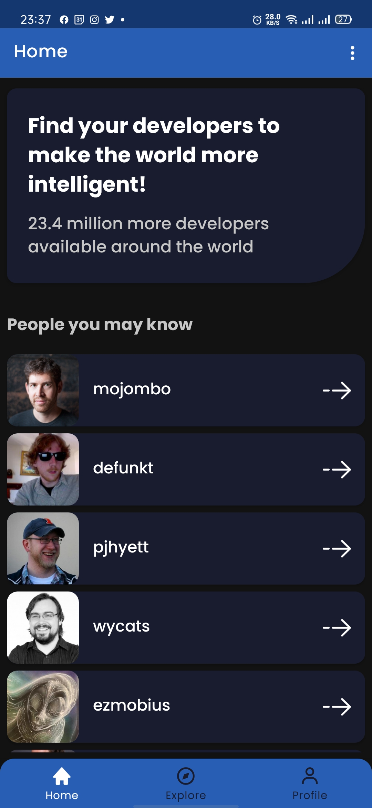
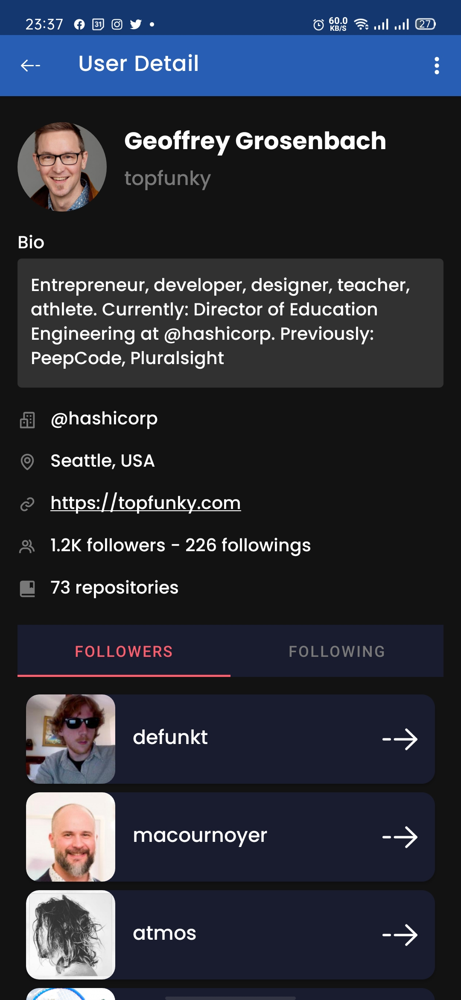
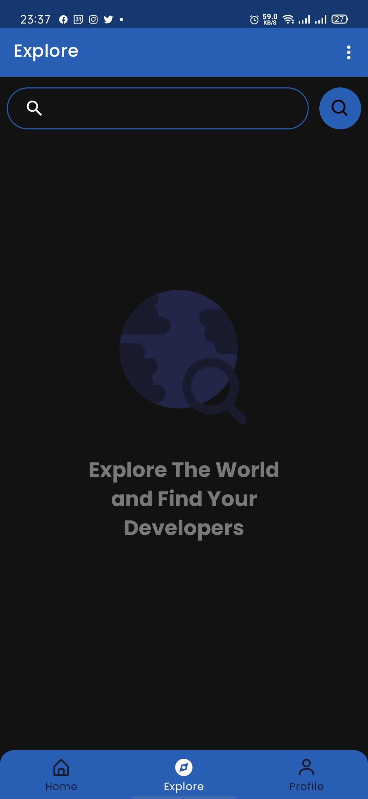
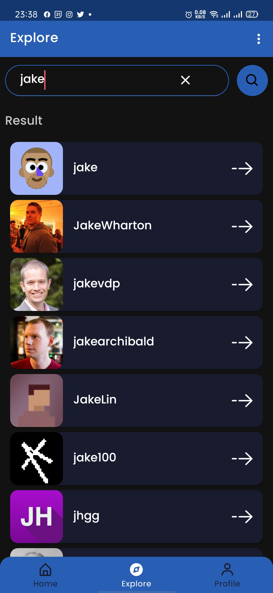
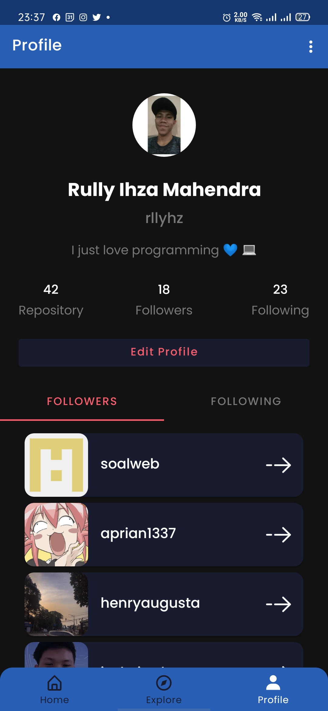

# Dicoding Submission: Belajar Fundamental Aplikasi Android (Submission 2)
 [](http://developer.android.com/index.html) [](http://kotlinlang.org) [](https://developer.android.com/studio/releases/gradle-plugin) 

This repository is the result of my submission project in [Dicoding Academy](https://www.dicoding.com) class, **Learn Fundamental Android Application** that implements MVVM(Model View ViewModel) architecture using the components ViewModel, LiveData, Dagger2, Room, etc. </br>
This project **gets 5 stars** 🎉🎉

You can clone this repo and import to your Android Studio

```
    https://github.com/rllyhz/github-user-app-2
```

## Demo

<h3 align="center">
  Home
</h3>
<p align="center">
    
</p>

<h3 align="center">
  User Detail
</h3>
<p align="center">
    
</p>

<h3 align="center">
  Explore
</h3>
<p align="center">
    
    
</p>


<h3 align="center">
  Profile
</h3>
<p align="center">
    
</p>


## Features:

- Using MVVM (Model-View-ViewModel) Architecture
- Using Dagger Hilt for dependency injection
- Using Navigation Components for Navigation UI
- Using Localization for support Indonesian and English languages
- Using Room Persistence for local database
- Using ViewBinding
- Using Kotlin StateFlow to handle state flow of data
- Using Retrofit to request API network
- Using Glide for loading and caching image from URL

## Dependencies :
- [Lifecycle & Livedata](https://developer.android.com/jetpack/androidx/releases/lifecycle)
- [Navigation Component](https://developer.android.com/jetpack/androidx/releases/navigation)
- [Dagger Hilt](https://dagger.dev/hilt/)
- [Retrofit 2](https://square.github.io/retrofit/)
- [Glide](https://github.com/bumptech/glide)
- [AndroidX](https://mvnrepository.com/artifact/androidx)
- [Kotlin StateFlow](https://developer.android.com/kotlin/flow/stateflow-and-sharedflow)


## Author

**Rully Ihza Mahendra** - Reach me on LinkedIn [here](https://www.linkedin.com/in/rully-ihza-mahendra-275a591a5/) </br>
**My Personal Web** - [https://rllyhz.github.io](https://rllyhz.github.io) </br>
**My Email** - [rullyihza00@gmail.com](rullyihza00@gmail.com) </br>


## You can support me

> Just **star** or  **fork** this repository, and follow my github. You have *supported* me!


## LICENSE

```

   Copyright © 2021 Rully Ihza Mahendra

   Licensed under the Apache License, Version 2.0 (the "License");
   you may not use this file except in compliance with the License.
   You may obtain a copy of the License at

       http://www.apache.org/licenses/LICENSE-2.0

   Unless required by applicable law or agreed to in writing, software
   distributed under the License is distributed on an "AS IS" BASIS,
   WITHOUT WARRANTIES OR CONDITIONS OF ANY KIND, either express or implied.
   See the License for the specific language governing permissions and
   limitations under the License.

```